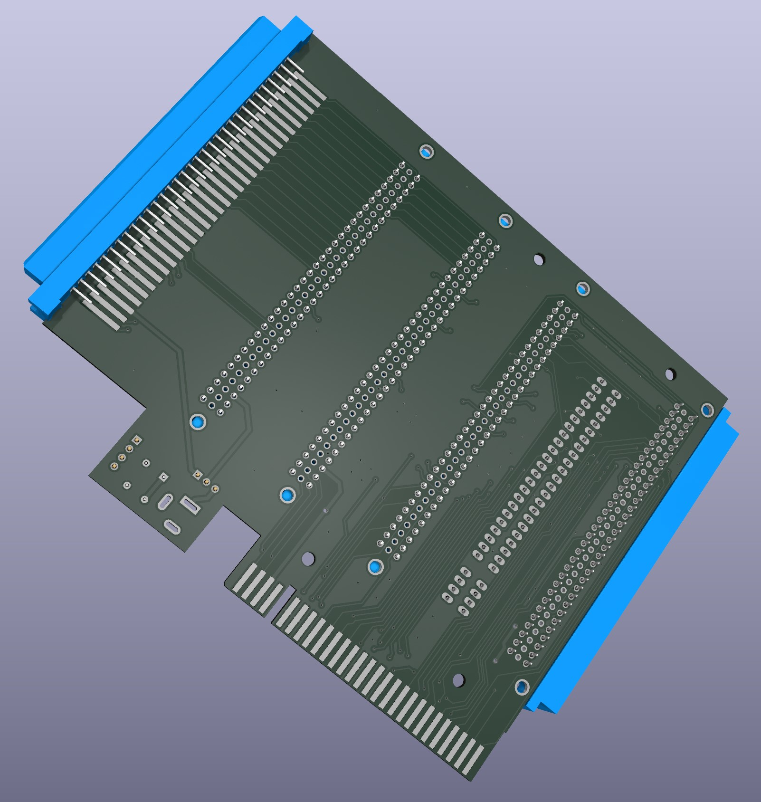

# Delta-S Backplane / Бекплейн для «Дельта‑С»

## RU

### Что это

Этот проект — печатная плата бекплейна для компьютера «Дельта‑С» (совместимая ZX‑архитектура), которая расширяет системную шину и упрощает подключение периферии.

Плата предназначена для:
- подключения нескольких дополнительных устройств через разъёмы СНП;
- вывода системных сигналов в формате ZX BUS / Nemo Bus;
- питания подключённых устройств либо от компьютера, либо от внешнего источника +5 В с аппаратным выбором источника.

---

### Ключевые возможности

- **4 слота СНП для модулей расширения** (разъёмы J2–J5).
- **Системный вход от компьютера «Дельта‑С»** через угловой СНП‑разъём (J1).
- **Выводы на внешние шины**:
  - J6 — разъём ZX‑BUS;
  - J7 — edge‑разъём формата ZX Spectrum bus.
- **Два варианта питания +5 В**:
  - внутреннее (от хоста «Дельта‑С»);
  - внешнее через barrel‑jack (J8) / штыревой разъём питания (J9).
- **Переключение источника питания джампером JP1**:
  - `1–2` — internal +5V power;
  - `2–3` — external power.
- **Фильтрация питания на плате**: C1 (1000 µF) + C2 (0.1 µF).

---

### Разъёмы и элементы

| Обозначение | Назначение |
|---|---|
| J2, J3, J4, J5 | Слоты СНП для плат расширения |
| J1 | Входной разъём к компьютеру «Дельта‑С» (магистраль бекплейна) |
| J6 | Вывод шины ZX‑BUS |
| J7 | Edge‑разъём шины (ZX Spectrum bus format) |
| J8 | Внешнее питание через DC barrel jack |
| J9 | Штыревой разъём питания/сервисный вывод (+5V/GND) |
| JP1 | Выбор источника +5 В (внутренний/внешний) |
| C1, C2 | Сглаживание и развязка питания |

> Важно: перед установкой `JP1 = 2–3` убедитесь, что внешний источник стабилизирован и соответствует **+5 В DC**.

---

### Что внутри проекта

- `deltas_backplane.kicad_sch` — электрическая схема.
- `deltas_backplane.kicad_pcb` — топология печатной платы.
- `gerbers/` — набор Gerber/Excellon для производства.
- `Libs/` — локальные библиотеки символов, футпринтов и 3D‑моделей.

Проект выполнен в формате KiCad 9‑совместимых файлов.

---

### Производство и сборка

1. Откройте `deltas_backplane.kicad_pcb` в KiCad и визуально проверьте ревизию/маркировки.
2. Используйте готовые файлы из `gerbers/` или сгенерируйте свой комплект под нужную ревизию.
3. После пайки **сначала** установите джампер питания JP1 в нужный режим, **затем** подключайте периферию.
4. При использовании внешнего источника избегайте одновременной «жёсткой» подпитки +5 В от нескольких источников.

---

### Совместимость и контекст

По структуре сигналов проект рассчитан на ZX‑совместимую экосистему «Дельта‑С» с выводом шины в форматах ZX BUS / Nemo Bus. Фактическая совместимость конкретных периферийных устройств зависит от их электрических требований, распиновки и поведения управляющих сигналов.

---

## EN

### What this project is

This repository contains a backplane PCB for the **Delta‑S** computer (ZX‑compatible ecosystem). The board extends the system bus and makes peripheral expansion easier.

It is designed to:
- connect multiple expansion devices through SNP connectors;
- expose system signals in **ZX BUS / Nemo Bus** form factors;
- power attached devices either from the host computer or from an external +5 V source (hardware selectable).

---

### Key features

- **4 SNP expansion slots** (J2–J5).
- **Host connection to Delta‑S** via angled SNP connector (J1).
- **External bus outputs**:
  - J6 — ZX‑BUS connector;
  - J7 — edge connector in ZX Spectrum bus format.
- **Dual +5 V power options**:
  - internal (from the Delta‑S host);
  - external via barrel jack (J8) / header connector (J9).
- **JP1 power source selection**:
  - `1–2` — internal +5V power;
  - `2–3` — external power.
- **Onboard power filtering**: C1 (1000 µF) + C2 (0.1 µF).

---

### Connectors and parts

| Designator | Function |
|---|---|
| J2, J3, J4, J5 | SNP slots for expansion cards |
| J1 | Upstream connector to Delta‑S host bus |
| J6 | ZX‑BUS output |
| J7 | Edge bus connector (ZX Spectrum format) |
| J8 | External power input (DC barrel jack) |
| J9 | Pin header for power/service (+5V/GND) |
| JP1 | +5 V source select (internal/external) |
| C1, C2 | Bulk/decoupling capacitors |

> Important: before setting `JP1 = 2–3`, verify that your external PSU is properly regulated at **+5 V DC**.

---

### Repository contents

- `deltas_backplane.kicad_sch` — schematic.
- `deltas_backplane.kicad_pcb` — board layout.
- `gerbers/` — manufacturing Gerber/Excellon files.
- `Libs/` — local symbols, footprints, and 3D models.

The project uses KiCad file formats compatible with KiCad 9 workflows.

---

### Manufacturing and bring‑up notes

1. Open `deltas_backplane.kicad_pcb` in KiCad and confirm board revision/silkscreen.
2. Use the prepared set in `gerbers/` (or regenerate for your target revision).
3. After assembly, set JP1 to the required power mode **before** attaching expansion cards.
4. When using external power, avoid hard‑tying multiple +5 V sources without proper isolation.